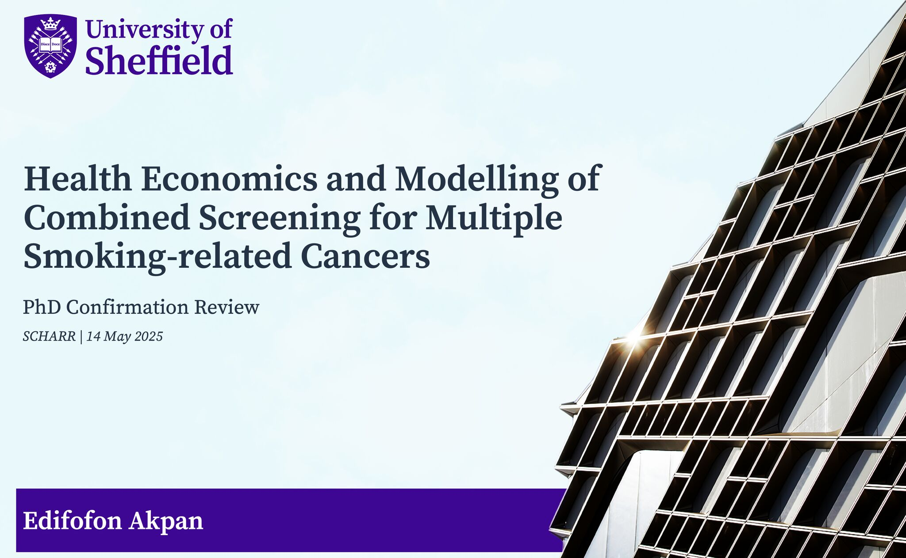

```{r setup, include=FALSE}
knitr::opts_chunk$set(fig.align = "center", fig.retina = 3,
                      fig.width = 6, fig.height = (6 * 0.618),
                      out.width = "90%", collapse = TRUE)
options(digits = 3, width = 300)
```

A few days ago (14 May), I had my confirmation review (or upgrade) for a [PhD in Public Health Economics and Decision Science](https://www.pheds-dtc.ac.uk/) at The University of Sheffield.

During the session, I discussed my project, which focuses on developing and applying decision models to estimate the potential impact of delivering multiple cancer screening interventions simultaneously to high-risk populations. After a 90-minute viva (which felt longer!), I was pleased to receive the news that my doctoral status was confirmed (pass, no corrections).

{#fig-phd-cr-slide}

I'd like to thank my amazing team of supervisors ([Lena](https://www.linkedin.com/in/lena-olena-mandrik-37341b11/), Chloe, and [Nick](https://www.linkedin.com/in/nick-latimer-29ab571/)) for their challenging thoughts on my plans and for reviewing the report. I would also like to thank Harry and [Sarah](https://www.linkedin.com/in/sarah-ren-950856223/), my two examiners, for taking the time to read through my \~20,000-word document (with loads of appendices!) and for providing excellent comments that I will work on over the next two years. I’d like to extend my appreciation to the many cancer experts who kindly answered my questions about screening processes and clinical pathways. Their insights were instrumental in helping me conceptualise my modelling plans.\
\
I am grateful to mentors and colleagues who have shaped my journey so far. [Tessa](https://www.linkedin.com/in/tessa-peasgood-266a5b2b4/), [Natalie](https://www.linkedin.com/in/natalie-carvalho-898203/), [Pete](https://www.linkedin.com/in/pete-dodd-46689440/), and [Alan](https://www.linkedin.com/in/alan-brennan-1445392b/) have provided invaluable guidance and encouragement throughout my academic and professional journey. Parts of my research plan were presented at the Screening Modellers Meeting at SCHARR, where I received insightful feedback from many attendees. I am also thankful to colleagues, especially [Wael](https://www.linkedin.com/in/wael-mohammed/), Thomas Gachie, [James](https://www.linkedin.com/in/james-oguta-05469788/) and [Elvis](https://www.linkedin.com/in/elvis-omondi-wambiya-80175610b/), for their thoughtful discussions and constructive input on various aspects of my plans. My PhD has greatly benefited from the expertise of [Rob](https://www.linkedin.com/in/robert-smith-dpa/) and Wael (again) at [Dark Peak Analytics](https://www.linkedin.com/company/dark-peak-analytics/), whose teaching in the Efficient Microsimulation Course has influenced my modelling plans. I can't recommend that course enough.

Scholarships have played a key role in my academic journey, by removing financial barriers to accessing world-class education and research opportunities. So, I am grateful to the [Wellcome Trust](https://www.linkedin.com/company/wellcome-trust/) for their exceptionally generous support of my PhD. This funding has covered tuition and living expenses, provided a separate budget for career development activities, and reimbursed my immigration-related costs (well over £8k). My previous studies were also fully funded: the [Australia Awards Africa ](https://www.linkedin.com/company/australia-awards-%E2%80%93-africa/) for my master’s degree, and the Agbami/Chevron Scholarship during my undergraduate studies.\
\
Finally, I am profoundly grateful to my lovely wife, Idy, and our son, Andiong, for their unwavering patience and support. I am especially thankful to my wife, who has generously rearranged her work schedule on multiple occasions to support my commitments.\
\
Incroyable!
