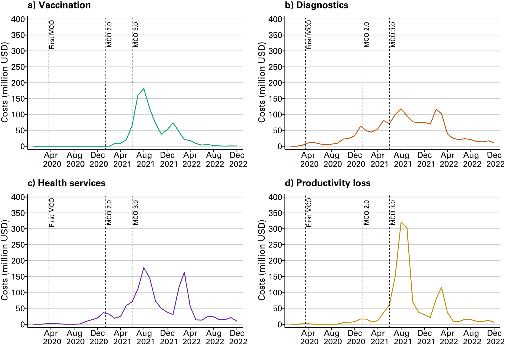

## Abstract

**Objective:** Malaysia recorded about 2.7 million COVID-19 cases as of December 31, 2022. An understanding of the overall health and economic burden of COVID-19 on healthcare services and productivity in Malaysia is important for policymakers for future planning and prioritising.

**Study design:** Retrospective study.

**Methods:** Using publicly available data from Ministry of Health Malaysia, we estimated the direct medical costs associated with COVID-19 from the health system perspective using a cost-of-illness approach. We used a human capital approach to estimate current and future productivity losses and calculated disability-adjusted life-years (DALYs) to estimate the burden of disease associated with illness and premature mortality. All future costs and outcomes were discounted at 3 %.

**Findings:** From January 2020 to December 2022, 28,803 COVID-19 related deaths occurred, and the DALYs associated with these was 638,601. The total estimated cost due to COVID-19 amounted to US\$5.2 billion, with direct medical costs making up the largest component (73 %) of these costs, at US\$2.8 billion. COVID-19 Quarantine and Treatment Centres, COVID-19 testing, and hospitalizations accounted for the largest share of total direct expenditures. Productivity losses (27 % of total costs) were driven by future lost earnings resulting from premature mortality.

**Conclusion:** The COVID-19 pandemic resulted in considerable economic and disease burden in Malaysia, and during the three years the disease burden was comparable to that of all respiratory illnesses. Our estimates underestimate the full impact of COVID-19, as opportunity costs and health impacts of a diversion of services during surges of COVID-19 cases, and spill-over effects to other sectors of the economy, are not captured here.

## Figures

