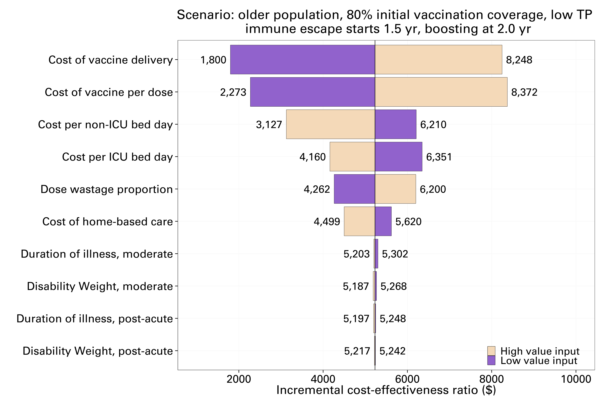

## Abstract

**Background:** Following widespread exposure to Omicron variants, COVID-19 has transitioned to endemic circulation. Populations now have diverse infection and vaccination histories, resulting in heterogeneous immune landscapes. Careful consideration of vaccination is required through the post-Omicron phase of COVID-19 management to minimise disease burden. We assess the impact and cost-effectiveness of targeted COVID-19 vaccination strategies to support global vaccination recommendations.

**Methods:** We integrated immunological, transmission, clinical and cost-effectiveness models, and simulated populations with different characteristics and immune landscapes. We calculated the expected number of infections, hospitalisations and deaths for different vaccine scenarios. Costs (from a healthcare perspective) were estimated for exemplar country income level groupings in the Western Pacific Region. Results are reported as incremental costs and disability-adjusted life years averted compared to no additional vaccination. Parameter and stochastic uncertainty were captured through scenario and sensitivity analysis.

**Findings:** Across different population demographics and income levels, we consistently found that annual elder-targeted boosting strategies are most likely to be cost-effective or cost-saving, while paediatric programs are unlikely to be cost-effective. Results remained consistent while accounting for uncertainties in the epidemiological and economic models. Half-yearly boosting may only be cost-effective in higher income settings with older population demographics and higher cost-effectiveness thresholds.

**Interpretation:** The seresults demonstrate the value of continued booster vaccinations to protect against severe COVID-19 disease outcomes across high and middle-income settings and show that the biggest health gains relative to vaccine costs are achieved by targeting older age-groups.

## Figures

![Figure 3: Cost-effectiveness results for different vaccination strategies in high transmission high vaccination coverage settings, for older (Group A) and younger (Group B) demographics with early (1.50 year) and late (2.50 year) seeding of an immune evading variant. Top figures represent cost-effectiveness planes for (a) older population and (b) younger population. Bottom figures show cost-effectiveness acceptability curves considering stochastic uncertainty and economic parameter uncertainty for the most cost-effective high-risk strategies for (c) older population and (d) younger population. The boosting strategies considered here are: pediatric boosting (ages 5-15), high-risk boosting (65+ in the older population, 55+ in the younger population) and random boosting at 2 years. High risk boosting is the most cost-effective strategy and dominates pediatric and random boosting strategies.](le-2024-figure3.png)

